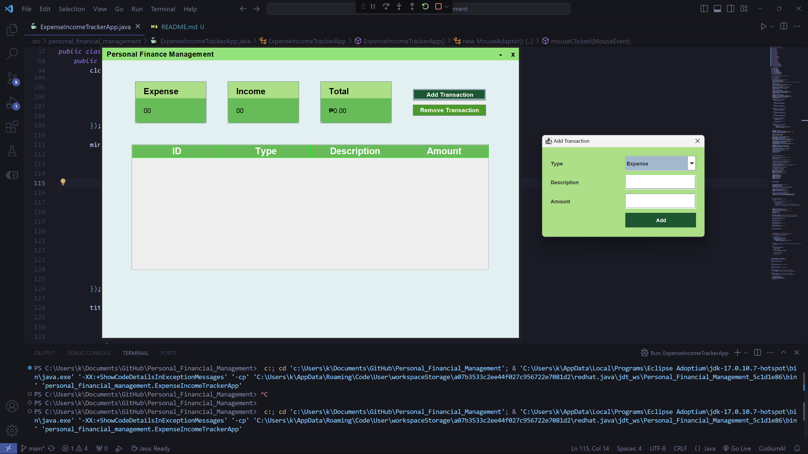

# Personal Financial Tracker

## Members
- Jhon Lloyd Omblero
- Reggie Hermosisima
- Chas Omer Madlos
- Sean Vergel Labnotin

## Description/Overview
The **Personal Financial Tracker** is a desktop application designed to help users manage and track their expenses and income. It allows users to categorize their expenses, set budgets, and generate financial reports. The application leverages Object-Oriented Programming (OOP) principles such as encapsulation, inheritance, and polymorphism to ensure a modular and maintainable codebase.

## Features
- **Expense and Income Management**: Add, edit, and delete transactions.
- **Categorization**: Categorize expenses and income for better tracking.
- **Budgeting**: Set and manage budgets.
- **Financial Reports**: Generate and view financial reports.
- **Customizable UI**: Enhanced user interface with custom components.
## Sample UI


## Technologies Used
- **Java**: Core language for application development.
- **Swing**: GUI framework for building the user interface.
- **Apache POI**: For reading from and writing to Excel files.

## Getting Started

### Prerequisites
- **Java Development Kit (JDK)**: Install the latest version of JDK from [Oracle](https://www.oracle.com/java/technologies/javase-jdk11-downloads.html) or [OpenJDK](https://openjdk.java.net/install/).
- **NetBeans IDE**: Download and install NetBeans from [NetBeans](https://netbeans.apache.org/download/index.html).
- **Visual Studio Code (VS Code)**: Download and install VS Code from [Visual Studio Code](https://code.visualstudio.com/Download).

### Installation Steps
1. **Clone the Repository**
   ```sh
   git clone https://github.com/joxyle-jhon/Personal_Financial_Management.git
   cd ExpenseIncomeTrackerApp
